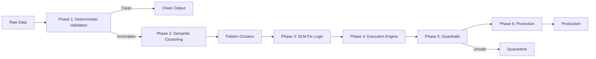

# Project Solva

<p align="center">
  
</p>

<p align="center">
  
</p>

<p align="center">
  
  
  
  
  
  <a href="LICENSE"></a>
</p>

<p align="center">
  <strong>Deterministic ingestion, semantic anomaly clustering, local SLM remediation, and execution staging for ETL data quality workflows.</strong>
</p>

<p align="center">
  Built to detect recurring anomaly patterns, compress them into actionable clusters, and generate structured remediation logic without depending on external cloud LLMs.
</p>

## Overview

Project Solva is an AI-assisted data observability and anomaly remediation pipeline designed to safely detect, cluster, and correct problematic records in ETL and data migration workflows.

The core idea is simple:

- Let 99% of clean data move through a fast lane.
- Isolate the remaining 1% of problematic rows.
- Cluster similar anomaly patterns into reusable families.
- Generate deterministic transformation logic instead of blind direct edits.
- Apply changes with guardrails, audit logs, and reversible workflows.

## Why this project exists

Traditional ETL tooling is optimized for movement, not semantic understanding. When malformed records appear, pipelines either fail or propagate corrupted data downstream. This creates a recurring cycle of manual remediation, operational drag, and compliance risk when sensitive data is sent to external services.

Project Solva addresses that with a local-first, explainable remediation architecture that detects anomaly patterns and safely generates transformation logic with validation and auditability.

## Current snapshot

- Phase 1: deterministic ingestion, schema-aware validation, duplicate checks, and anomaly shaping.
- Phase 2: embeddings, semantic grouping, Chroma persistence, and cluster memory reuse.
- Phase 3: local Ollama-backed remediation generation with retrieval-aware prompting.
- Phase 4: execution staging, contract validation, sandbox checks, and audit artifacts.
- Phase 5: guardrail policy enforcement, review routing, and circuit-breaker logic.
- Phase 6: promotion gating for approved candidates and final output reporting.
- The project runs end-to-end from `main.py` with an interactive dataset workflow.

## What makes it interesting

- Instead of fixing anomalies row-by-row, Project Solva clusters similar failures into reusable anomaly families.
- Instead of letting a model edit data directly, it generates structured transformation logic with confidence and audit context.
- Instead of depending on hosted LLM APIs, the remediation path is aligned to a local-first Ollama workflow.
- Instead of treating retrieval as prompt stuffing, the system persists cluster and remediation memory for future reuse.

## Architecture



## End-to-end flow

1. Phase 1 - Ingestion
   - Read raw input from local JSON, JSONL, or CSV sources.
   - Apply deterministic validation for required fields and typed columns.
   - Check for duplicates and split clean rows from anomalies.
   - Emit downstream-safe anomaly records for clustering.

2. Phase 2 - Semantic Clustering
   - Convert anomaly rows into text and generate embeddings.
   - Group semantically similar anomalies into clusters.
   - Persist embeddings and cluster memory in ChromaDB.
   - Reuse pattern cache to detect repeated anomaly signatures.

3. Phase 3 - SLM Remediation
   - Normalize clusters into remediation-ready prompts.
   - Retrieve static rules plus persisted memory for context.
   - Send cluster context to a local Ollama SLM.
   - Generate structured transformation logic with confidence and audit metadata.

4. Phase 4 - Execution Engine
   - Validate remediation contracts before staging execution.
   - Safely compile and apply approved remediation lambdas.
   - Split staged and quarantined outputs.
   - Persist execution artifacts for downstream guardrails.

5. Phase 5 - Guardrails
   - Enforce confidence checks, review gates, and quarantine policies.

6. Phase 6 - Promotion
   - Promote only approved candidates into a production-ready payload.
   - Write final promotion artifacts and summaries.

## Research report

This repository includes a detailed technical research report that outlines the architecture and vision behind Project Solva.

Key highlights:

- AI-assisted data observability and anomaly remediation for ETL pipelines.
- Semantic anomaly clustering using vector embeddings.
- Air-gapped local SLMs for deterministic remediation logic.
- Deterministic validation layers that protect data quality and auditability.

[Read the full Technical Research Report](https://docs.google.com/document/d/18OxN0zIwTQbQerZyc0kZhlI6RVxbouvK/edit?usp=sharing&ouid=105640942361964521743&rtpof=true&sd=true)

## Current implementation status

| Area | Status | Notes |
|---|---|---|
| Pipeline orchestrator (`main.py`) | Done | Interactive dataset prompt, loading animation, sequential execution, and terminal summary |
| Phase 1 Ingestion | Working | Deterministic validation, duplicate checks, and anomaly shaping |
| Phase 2 Clustering | Working | Embeddings, semantic grouping, and durable cluster memory |
| Phase 3 SLM Remediation | Working | Local Ollama provider, hybrid retrieval, and remediation memory reuse |
| Phase 4 Execution | Working | Contract validation, safe staging, and execution artifacts |
| Phase 5 Guardrails | Working | Policy checks, review routing, and audit reporting |
| Phase 6 Promotion | Working | Promotion gating and final production payload generation |
| UI + Tests + Docs | In Progress | Validation runners and unit tests are available through the repo |

## What works today

- Deterministic ingestion with required-field checks and duplicate detection.
- Semantic clustering of anomaly rows into compact pattern groups.
- Chroma-backed storage for embeddings, cluster memory, and remediation memory.
- Retrieval-aware Phase 3 prompting using static rules and persisted memory.
- Local Ollama-based remediation generation with structured JSON output.
- Confidence and guardrail-ready metadata in remediation outputs.
- Safe execution staging with sandbox validation and staged row transforms.
- Interactive CLI execution through `main.py`.
- Local validation through unit tests and integration debug runners.

## Repository layout

```text
project_solva/
├── main.py
├── config.py
├── requirements.txt
├── README.md
├── data/
├── docs/
├── logs/
├── phases/
├── prompts/
├── tests/
├── ui/
└── utils/
```

## Quick start

```bash
# 1) Create a virtual environment
python -m venv .venv

# 2) Install dependencies
pip install -r requirements.txt

# 3) Start Ollama
ollama serve
ollama pull llama3.1:8b

# 4) Run the pipeline
.\.venv\Scripts\python.exe main.py
```

### Optional: UI dashboard

Project Solva includes a local Streamlit dashboard for upload-driven runs.

```bash
.\.venv\Scripts\python.exe -m streamlit run ui\dashboard.py
```

What the dashboard provides:

- Upload input data in CSV, JSON, or JSONL format.
- Optionally upload a schema JSON for validation.
- Run the full Phase 1 → 6 workflow from the browser.
- Inspect phase-by-phase metrics and promotion blockers.
- Download generated artifacts individually or as a zipped run bundle.

Sample dataset included in the repo:

```text
data/raw/production_like_1000_rows.json
```

## Expected run behavior

- The pipeline starts, prompts for a dataset path, and runs each phase in sequence.
- A terminal spinner indicates the currently running phase.
- Phase 1 reads local input data, applies validation, and emits clean and anomaly outputs.
- Phase 2 groups anomalies into semantic clusters and persists retrieval memory.
- Phase 3 consumes clusters and produces structured remediations using local Ollama and cached context.
- Phase 4 validates and stages remediation logic against anomaly-linked rows.
- Phase 5 evaluates staged records and writes a guardrail audit report.
- Phase 6 promotes approved rows into a production-ready payload.
- The terminal prints a final runtime summary and saved output locations.

## Local validation

```bash
# Unit validation for ingestion
pytest tests/test_ingestion.py -q

# Unit validation for clustering
pytest tests/test_clustering.py -q

# Unit validation for remediation
pytest tests/test_phase3_slm_remediation.py -q

# Unit validation for execution
pytest tests/test_phase4_execution.py -q

# Combined integration runners
python tests/debug_phase12_runner.py
python tests/debug_phase23_runner.py
```

Current expected result:

- Phase 1 emits deterministic anomaly records in a format Phase 2 can consume.
- Phase 2 forms anomaly clusters from sample data.
- Phase 3 returns structured remediations for those clusters.
- Phase 4 stages valid remediations and quarantines unsafe ones.
- The local provider path should show `ollama/<model-name>` in the output summary.

### Example validation summary

```text
Phase 1: 5 rows -> 1 clean, 4 anomalies
Phase 2: 4 anomalies -> 1 cluster
Phase 3: 4 remediations, provider=ollama
Phase 4: staged=3, quarantined=1, applied_rows=12
```

## Tests

Current automated validation status:

- Full test suite: `35 passed`
- Covered areas: ingestion, clustering, remediation, execution, guardrails, and promotion
- Phase 3 tests use the mock provider for deterministic validation when required

Run the full suite:

```bash
pytest -q
```

Run phase-specific suites:

```bash
pytest tests/test_ingestion.py -q
pytest tests/test_clustering.py -q
pytest tests/test_phase3_slm_remediation.py -q
pytest tests/test_phase4_execution.py -q
pytest tests/test_phase5_guardrails.py -q
pytest tests/test_phase6_promotion.py -q
```

## Stress test report

Observed local stress-test snapshot on the current implementation:

- Dataset: `100,000` production-style CSV rows
- Runtime: approximately `74.6 sec` end-to-end on the local heat-test path
- Input rows: `100,000`
- Anomalies detected: `1,785`
- Clusters formed: `2`
- Remediations generated: `2`
- Guardrail-approved clusters: `0`
- Promoted rows: `0`
- Promotion status: `blocked` because `guardrail_review_pending`

Phase timing snapshot:

- Phase 1 Ingestion: `~2.57 sec`
- Phase 2 Clustering: `~70.03 sec`
- Phase 3 Remediation: `~2.03 sec`
- Phase 4 Execution: `~0.006 sec`
- Phase 5 Guardrails: `~0.005 sec`
- Phase 6 Promotion: `~0.001 sec`

Interpretation:

- Throughput remains strong for a local-first prototype running validation, embeddings, clustering, remediation, execution staging, and guardrails in one flow.
- The main remaining bottleneck is Phase 2 embedding and clustering work.
- The heat-test result shows significant performance improvement while still highlighting the need for production-grade optimization before broader deployment claims.

## Design principles

- Decoupled pipeline: anomaly processing should not block ingestion throughput.
- Air-gapped AI architecture: sensitive enterprise data remains local.
- Auditability: every remediation decision should be traceable.
- Reversibility: unsafe outputs should be quarantined and replay-safe.

## Practical roadmap

- Add richer CLI configuration and schema-path prompting.
- Add scheduler and API-driven triggers on top of the current interactive runner.
- Expand deployment, monitoring, and production storage adapters beyond local artifacts.
